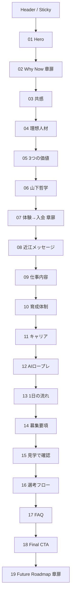
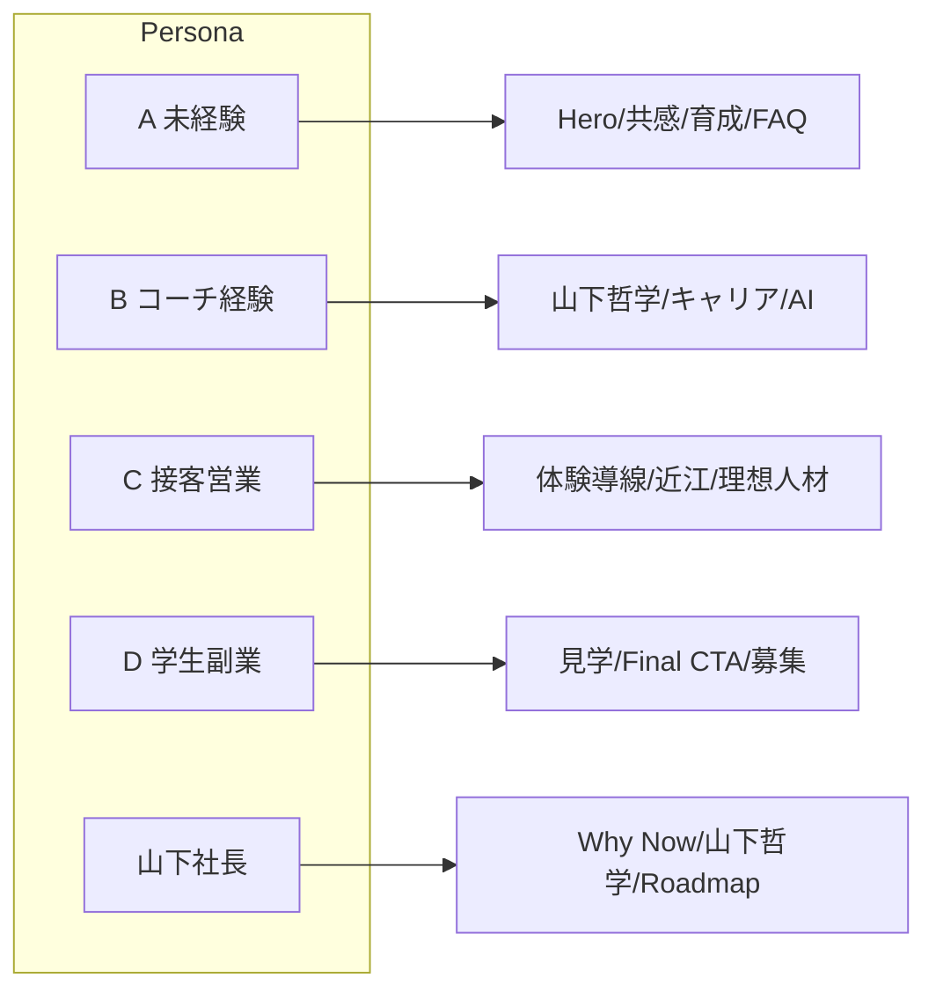

# テニスプラザ尼崎 採用LP ビジュアル設計 / Variant B — Court Editorial

- 作成日：2026-05-24
- 目的：来週の山下社長デモで提示する採用LPのB案（大人プレイフル × エディトリアル）を、実装可能な粒度まで仕様化する。
- 推奨閲覧者：アリガトサン内（PM・デザイナー・実装）、ならびに最終確認の代表者。
- 位置付け：`tennis_plaza_recruit_lp_visual_design_plan.md`（v1）の世界観を否定せず、編集設計の文脈に「進化させた別解」。19セクション再構成案（`tennis_plaza_recruit_lp_section_restructure_plan.md`）に完全準拠。

---

## 0. ドキュメントの読み方

```text
1. 「コンセプト → ターゲット → ムード」で世界観を握る
2. 「カラー / タイポ / レイアウト / モーション」でシステムを握る
3. 「セクション別 詳細設計」で実装に持っていく
4. 「実装差分 / デモ台本 / リスク」で社長に出す
```

設計の通底ルールは1つだけ。

```text
動くより、表れる。
コートサイドで読む一冊の採用ジャーナル。
```

---

## 1. コンセプトステートメント — 1ページ目で社長に刺す3行

```text
コートサイドで読む、一冊の採用ジャーナル。
採用が、テニプラの「品」を語り直す。
求人媒体に出す前に、テニプラのブランドを大人として立てる。
```

3行の意味：

| 行 | 求職者への効果 | 山下社長への裏メッセージ |
|---|---|---|
| コートサイドで読む、一冊の採用ジャーナル | 求人ページとは思えない読み物としての引力 | 採用ブランドが大人として成立している |
| 採用が、テニプラの「品」を語り直す | スクールの空気感そのものに惹かれる | 家族や知人にも勧められるトーン |
| 求人媒体に出す前に、テニプラのブランドを大人として立てる | 「ここなら自分も語れる場所」と思える | ジュニア保護者・西宮展開LPへ転用できる土台 |

---

## 2. ターゲットペルソナ別 刺さり方マッピング

| ペルソナ | A：テニス経験あり・指導未経験 | B：コーチ経験者 | C：接客・営業経験者×テニス | D：アルバイト・副業・学生 | 山下社長 / 近江さん |
|---|---|---|---|---|---|
| Bの一次効用 | 「文章として読める」「強要されない」読了体験 | 「文化のあるスクール」「言語化された哲学」への共鳴 | 「品のある入会案内」＝自分の経験で勝負できる場 | 重さを感じさせない余白／逃げ道の明文化 | 採用LPが「大人ブランド」として独立 |
| 効くセクション | Hero / Section 3 共感 / Section 10 育成 / Section 17 FAQ | Section 6 山下哲学 / Section 11 キャリア / Section 12 AIロープレ | Section 7 体験→入会 / Section 8 近江 / Section 4 理想人材 | Section 15 見学 / Section 18 Final CTA / Section 14 募集 | Section 2 Why Now / Section 6 山下哲学 / Section 19 Future |
| Bが効く理由 | 「読ませる」設計と引用ブロックが、本人が周囲に説明したくなる温度 | エディトリアルが「経営側」を主役にせず、現場哲学を本として並べる | カードや営業っぽさを後退させ、文章主導で「品」を共通言語にできる | 派手な煽りがないので、軽い気持ちで読み進めやすい | ジュニアスクール／西宮テニスクラブの保護者層にもそのまま転用可 |

Bでとくに意識する刺し方：

- ペルソナBには「他では作れない記事」として「山下コーチ哲学（Section 6）」を、引用ブロック・署名・章番号で文字どおり「本の特集」に仕立てる。
- ペルソナCには「Section 7 体験から入会まで」を罫線タイムラインで読ませ、入会案内を「営業」ではなく「編集された接客」として翻訳する。
- 山下社長には、Section 19 Future Roadmap までを「採用LPと同じトーン」で並べることで、HP・西宮LPへの拡張余地を直感させる。

---

## 3. ムード / リファレンス（言語化のみ）

| リファレンス | 抽出するエッセンス | Bでの適用ポイント |
|---|---|---|
| Number（スポーツ雑誌） | 写真と引用で勝負する縦組み構成、スコア風メタ表記 | 章扉 / 山下哲学 / 1日の流れ |
| Racquet Magazine | 余白を恐れない大判ビジュアル、Corallike accent、人物の手元クローズアップ | Hero / Section 6 / Section 8 |
| The Players' Tribune | 当事者の一人称ロング引用、署名と日付の重み | Section 6 山下哲学 / Section 8 近江メッセージ |
| Off-White Magazine | "QUOTE" や `№` のような印刷組版的タイポ遊び、メタテキストの黒帯 | Header / Section 13 1日の流れ / Footer |
| Apartamento | 生活感のあるスナップ写真、控えめなナンバリング、本棚のような縦並びカード | Section 5 価値 / Section 11 キャリア |

避けたい印象：

```text
- グラデーション過多のSaaS LP
- ストックフォト広告
- 体育会の熱血写真
- 派手なパララックスで本文を見せない映画予告風サイト
```

目指す体感は、「Web を開いたのに、本を一冊めくっている感覚」。

---

## 4. カラーシステム

### 4-1. 使う色と用途

| 役割 | 名前 | HEX | 主な用途 | 使用面積目安 |
|---|---|---|---|---|
| 主役・濃 | Deep Court Green | `#0B3B2E` | Hero章扉の濃面 / Quoteの線 / Footer | 12% |
| 主役・地 | Warm White | `#F8F6EF` | 全セクションの基本背景 | 60% |
| 文字 | Ink | `#17212B` | 本文・見出し（黒に近い藍） | 12% |
| アクセント | Clay Coral | `#FF7A59` | 引用記号 / 章番号 / hover下線 / チェック | 4% |
| サブ・線 | Rally Green | `#18A36B` | ラインアイコンのストロークのみ | 2% |
| 補助 | Sky Blue | `#7DD3FC` | Section 12 AIロープレ / Section 19 Future の補助 | 2% |
| 極小アクセント | Tennis Yellow | `#D9FF43` | CTA内の1pxアンダーバー / 見学導線chip | 1% |
| 補助グレー | Soft | `#E6E9E6` | hairline / カード罫線 | 7% |

合計面積感：

```text
Warm White : Deep / Ink : Coral : その他 = 60 : 24 : 4 : 12
```

### 4-2. コントラスト指針

| ペア | 目的 | コントラスト比目標 |
|---|---|---|
| Ink #17212B on Warm White #F8F6EF | 本文 | 12.6:1（AAA） |
| Warm White on Deep Court #0B3B2E | 章扉の白文字 | 11.9:1（AAA） |
| Clay Coral #FF7A59 on Warm White | アクセントのみ。本文には使わない | 3.2:1（装飾用途・本文不可） |
| Tennis Yellow on Deep Court | CTAのアンダーバー1pxのみ | 装飾用途 |
| Sky Blue on Warm White | アイコンライン | 装飾用途・キャプションには使わない |

ルール：

- Clay Coral は「本文の色」として使わない。記号・章番号・hover下線・チェック・タグの背景に限定。
- Tennis Yellow を面で使わない。CTA内の1px下線とチップの内側1pxのみ。Aで主役だった黄色を、Bでは「儀礼的な栞」として最小化する。
- Sky Blue は Section 12 / 19 だけ。他では使わない（ブランドの軸足を失う）。

### 4-3. 禁則

```text
- 緑1色のべた塗りセクションを連続させない（紙の白を必ず挟む）
- グラデーションは Hero / Final CTA の Deep Court 1色微変化のみ
- Coral と Yellow を同じビューで衝突させない
- 角丸 12px 以上のソフトUI禁止。Bは4pxのシャープを通す
- 写真の上に Coral 文字 → Quote記号を除き禁止
```

### 4-4. ノイズと紙質感

- `bg-noise`：4-6%密度のSVGノイズ（`feTurbulence baseFrequency=0.9, numOctaves=2`）を Warm White 全域に乗せる。
- スクロールしても固定（`background-attachment: fixed` は使わず、CSS pseudo の固定レイヤで重ねる）。
- 写真の上には乗せない（写真は被写体側のグレインで質感を出す）。

---

## 5. タイポグラフィシステム（和欧混植が肝）

### 5-1. 書体ロスター（5書体に絞る）

| 区分 | 書体 | 用途 | ウェイト |
|---|---|---|---|
| 英ディスプレイ | Fraunces Italic | H1英字 / 章扉 / Quote `“ ” ¶` | 600 Italic |
| 英サンセリフ | Inter | キャプション / メタ / ラベル | 400 / 500 |
| 英モノ | JetBrains Mono | 章番号 `№ 03` / フォリオ / タイムスタンプ | 400 |
| 和ディスプレイ | Noto Serif JP Semibold | Hero和文 / 章扉和文 / Quote本文 | 600 |
| 和本文 | Noto Sans JP | 本文・キャプション本文 | 400 / 500 |

5書体合計：preload 5本（subset 済 woff2）。Total < 220KB を目標。

### 5-2. 用途別ペアリング

| 用途 | サンプル | 仕様 |
|---|---|---|
| Hero H1（和） | テニスを教えるだけではなく、 | `Noto Serif JP 600 / clamp(34px, 4.8vw, 64px) / line 1.55 / letter 0.01em` |
| Hero H1（英） | *Rally the Future.* | `Fraunces Italic 600 / clamp(40px, 6vw, 80px) / line 1.05 / letter -0.01em` |
| 章扉ナンバー | `№ 02 — WHY NOW` | `JetBrains Mono 400 / 14px / letter 0.18em / uppercase / Coral色` |
| セクション見出し（和） | 順調な今だからこそ、 | `Noto Serif JP 600 / clamp(26px, 3.2vw, 40px) / line 1.6` |
| セクション見出し（英 small caps） | `EDITOR'S NOTE` | `Inter 500 / 12px / letter 0.24em / uppercase / Ink` |
| 本文 | `Noto Sans JP 400 / 16px (PC 17px) / line 1.95 / letter 0.02em` | AAA確保 |
| 引用本文 | `Noto Serif JP 600 / 22px / line 1.7 / letter 0.02em` | 引用記号は Fraunces Italic |
| キャプション | `Inter 500 / 12px / letter 0.16em / uppercase`（英）／`Noto Sans JP 400 / 12px`（和） | 写真キャプション・図番号 |
| メタ（章番号・page folio） | `JetBrains Mono 400 / 11px / letter 0.18em` | Coral または Ink 60% |
| CTAラベル | `Inter 500 / 14px / letter 0.14em / uppercase` ＋ `Noto Sans JP 500 / 14px` 併記 | 例：`VISIT TENNIS PLAZA / まずは見学してみる` |

### 5-3. small caps の使い場

- ナビ / 章番号 / 写真キャプション / フッターの folio。
- 和文と混ぜるとき、英側だけ「small caps + letter 0.18em」を効かせ「印刷物の小見出し」風に。

### 5-4. フォールバック

```css
font-family:
  "Noto Serif JP", "Hiragino Mincho ProN", "YuMincho", serif; /* 和ディスプレイ */
font-family:
  "Noto Sans JP", "Hiragino Sans", "Yu Gothic", system-ui, sans-serif; /* 和本文 */
font-family:
  "Fraunces", "Georgia", "Times New Roman", serif; /* 英ディスプレイ */
font-family:
  "Inter", "Helvetica Neue", "Arial", sans-serif; /* 英サンセリフ */
font-family:
  "JetBrains Mono", "IBM Plex Mono", "SFMono-Regular", monospace; /* 英モノ */
```

---

## 6. レイアウトシステム

### 6-1. マガジングリッド

```text
container: 1080px (max). 余白は 1280px 視野でも左右に 100px ずつ取る
columns: 12
gutter: 24px
section padding: PC clamp(96px, 12vw, 168px) / SP 64px
inner padding: 32px
```

### 6-2. 章扉ページ

「Why Now（Section 2） / 体験〜入会（Section 7） / Future Roadmap（Section 19）」の3か所に挟む。

```text
+-------------------------------------------------------+
| № 02                                                  |
|                                                       |
|        WHY  NOW                                       |
|        順調な今だからこそ、                           |
|        次の成長を支える人材が必要です。               |
|                                                       |
|        — Editor's Note —                              |
|                                                       |
+-------------------------------------------------------+
|                                                       |
|    [    Full-bleed B&W寄り 写真    ]                  |
|                                                       |
+-------------------------------------------------------+
```

- 縦線（1px Coral）が左に1本、フォリオが下に。
- 写真は全幅 / アスペクト 21:9。SP は 4:5 に組み直す。
- リードは Noto Serif JP 600 / 28px / 2行まで。

### 6-3. 罫線とフォリオ

| 罫線 | 仕様 |
|---|---|
| Hairline | `border-top: 1px solid rgba(23,33,43,0.18)` |
| Section divider | 上に hairline、下に `№` の小見出し / `EDITOR'S NOTE` のメタを置く |
| Quote 罫 | 左に `border-left: 2px solid #FF7A59`、上下に hairline |

フォリオ（ページ番号）：

```text
画面右下 fixed: "Folio 03 / 19  ·  Court Editorial"
JetBrains Mono 11px / Ink 60% / Coral dot
スクロールに応じて 03 → 04 ... と切り替わる（ScrollSpy）
```

### 6-4. 写真処理3パターン

| パターン | 用途 | 仕様 |
|---|---|---|
| A. Full-bleed B&W寄り | Hero / 章扉 / Final CTA | `filter: grayscale(0.18) saturate(0.94) contrast(1.04)`、上にノイズなし、Coral のキャプションタグ |
| B. 正方形 Coral マット枠 | Section 5 価値 / Section 9 仕事内容 | 1:1、外枠 2px Coral、枠の外に4pxのオフセット白フレーム |
| C. ポートレート 細罫線 | Section 6 山下 / Section 8 近江 | 4:5、外周 hairline 1px Ink 30%、左下に署名キャプション |

写真キャプションの定型：

```text
[Caption]  Coach Yamashita · Tennis Plaza Amagasaki · 2026
[Folio]    Figure 04
```

### 6-5. レイヤー優先順

```text
1. 写真 / 罫線（編集の骨）
2. 見出し / 引用（読ませる）
3. 本文 / CTA（決めさせる）
4. モーション（補助）
```

---

## 7. アイコノグラフィ & イラストレーション方針

### 7-1. アイコン

- ベース：`lucide-react`、ストローク 1.25、サイズ 18-20px、色は Rally Green `#18A36B` の単色。
- 装飾アイコンは使わない。意味のあるアイコンだけ（チェック、矢印、外部リンク、見学）。
- アイコンとテキストの間は 8px、letter 0.04em。

### 7-2. 手書きスタンプ

- セクション内で「気づくと笑う」プレイフル要素として使う。
- ペン感：Coral カラーで `stroke 1.6px`、Rough.js 風の手描き SVG を5種類だけ用意（チェック✓、丸、二重線、矢印、テニスボール輪郭）。
- 出現箇所：
  - Section 7 体験→入会の「①〜⑤」
  - Section 15 見学で確認できることの「✓」
  - Section 17 FAQ の開閉アイコン（テニスボール輪郭、開で180度回転）

### 7-3. 線画イラスト

- Section 6 山下哲学 / Section 8 近江の「肩書サイン」だけ、手書き風の英字署名 SVG を Coral で配置。
- それ以外、抽象イラストは使わない（写真主導を貫く）。

### 7-4. 罫線アクセサリ

- 章扉の縦線（1px Coral × 60vh）。
- Quote の左罫（2px Coral × 100%）。
- セクション末尾の hairline（1px Ink 18%）。

---

## 8. モーションシステム

### 8-1. 基本原則

```text
原則：動くより、表れる。
動きは「読むリズム」を作るためにある。
1セクションに3つ以上のアニメーションを乗せない。
```

### 8-2. 命名規則

既存 globals.css の `.split-text` `.blur-text` `.scroll-reveal` 命名を尊重し、B独自分を `--b-` プレフィックスで足す。

| 命名 | 役割 |
|---|---|
| `.b-blur-in` | 14px → 0 のぼかし解除 |
| `.b-tilt-soft` | 最大1.2deg のホバーtilt |
| `.b-underline-coral` | hover下線 0→100% width |
| `.b-stroke-draw` | SVG path の stroke-dashoffset を 0 へ |
| `.b-scroll-float` | scroll位置で y -8px → 0、opacity 0 → 1 |
| `.b-bw-to-color` | 画像の grayscale 0.18 → 0 |
| `.b-folio` | Folio 切り替え（fade 240ms） |
| `.b-handwrite` | 手書き SVG の段階的描画 |

### 8-3. Easing 標準セット

| 名前 | cubic-bezier | 用途 |
|---|---|---|
| `out-expo` | `cubic-bezier(0.22, 1, 0.36, 1)` | ぼかし解除・テキスト出現 |
| `out-quint` | `cubic-bezier(0.83, 0, 0.17, 1)` | スクロール連動 |
| `in-out-cubic` | `cubic-bezier(0.65, 0, 0.35, 1)` | hover の往復 |
| `linear` | `linear` | folio fade |

### 8-4. Motion Budget（強さ 1-5）

| セクション | 強さ | 主要モーション | コメント |
|---|---:|---|---|
| 0 Header | 1 | hover italic 切替・Magnetなし | 邪魔しない |
| 1 Hero | 4 | `b-blur-in` × 見出し、`ParallaxScale 0.98→1` × 写真 | 動かしすぎず、引きで魅せる |
| 2 Why Now（章扉） | 3 | 縦線 + 章番号の `b-stroke-draw` | 一筆書き |
| 3 共感 | 2 | カードの ScrollReveal stagger 80ms | 読みやすさ最優先 |
| 4 理想人材 | 2 | 大見出し `b-blur-in` のみ | Aと差別化 |
| 5 3つの価値 | 2 | hover時 `b-underline-coral` のみ | カードは静止 |
| 6 山下哲学 | 3 | 写真 `b-tilt-soft`、引用 `b-scroll-float` 1行ずつ | 主役は写真と引用 |
| 7 体験→入会（章扉） | 4 | 縦線 `b-stroke-draw`、`①〜⑤` `b-handwrite` | 線がスクロール同期 |
| 8 近江メッセージ | 2 | ScrollReveal 1回 | 落ち着き優先 |
| 9 仕事内容 | 2 | カードの ScrollReveal stagger 60ms | 縦並び紙片 |
| 10 育成体制 | 2 | チェック `b-handwrite` | チェック1つずつ |
| 11 キャリア | 3 | 紙片の縦積み（ScrollStackは使わない）、Step 3 Coral蛍光 | 静かに、しかし主張 |
| 12 AIロープレ | 3 | `grid-scan`（Sky Blue）、会話バブル `b-blur-in` 順次 | 既存 grid-scan を再利用 |
| 13 1日の流れ | 2 | 縦タイムラインのライン伸長 | スクロアな同期 |
| 14 募集要項 | 1 | 行 fade のみ | 信頼感 |
| 15 見学で確認できる | 3 | `b-handwrite` ✓ が1個ずつ | プレイフル |
| 16 選考フロー | 2 | Step active切替 | |
| 17 FAQ | 2 | テニスボール icon 180度回転 | プレイフル |
| 18 Final CTA | 3 | 見出し `b-blur-in` ＋ CTA の Yellow underline 描画 | 静かに熱く |
| 19 Future（章扉） | 3 | 縦線 + フェーズ stroke-draw | デモのフィナーレ |

### 8-5. Reusable patterns 仕様

#### `b-blur-in`

```css
@keyframes b-blur-in {
  from { filter: blur(14px); opacity: 0; transform: translateY(12px); }
  to   { filter: blur(0);    opacity: 1; transform: translateY(0); }
}
.b-blur-in {
  animation: b-blur-in 860ms cubic-bezier(0.22, 1, 0.36, 1) both;
  animation-delay: var(--delay, 0ms);
}
```

- stagger: 120ms（行単位）/ 60ms（文字単位）
- 行分割は IntersectionObserver 発火、once: true

#### `b-tilt-soft`

```css
.b-tilt-soft {
  transform: perspective(1200px) rotateX(0) rotateY(0);
  transition: transform 360ms cubic-bezier(0.22, 1, 0.36, 1);
}
.b-tilt-soft:hover {
  transform: perspective(1200px) rotateX(1.2deg) rotateY(-1.2deg) translateY(-3px);
}
```

#### `b-underline-coral`

```css
.b-underline-coral { position: relative; }
.b-underline-coral::after {
  content: ""; position: absolute; left: 0; bottom: -3px;
  height: 1px; width: 0%; background: #FF7A59;
  transition: width 360ms cubic-bezier(0.22, 1, 0.36, 1);
}
.b-underline-coral:hover::after { width: 100%; }
```

#### `b-stroke-draw`

```text
SVG: <path stroke-dasharray="L" stroke-dashoffset="L">
JS:  IntersectionObserver で dashoffset 0 へ 1200ms transition、ease out-expo
```

#### `b-handwrite`

```text
SVG path 群（"①" "②" .. "✓"）を順次に b-stroke-draw、各 stagger 180ms
```

#### `b-bw-to-color`

```css
.b-bw-to-color { filter: grayscale(0.18) saturate(0.94); transition: filter 300ms ease; }
.b-bw-to-color:hover { filter: grayscale(0) saturate(1); }
```

### 8-6. マイクロインタラクション仕様

| 場所 | インタラクション | パラメータ |
|---|---|---|
| ナビ a | hover で `font-style: italic` に切替＋下線描画 | 180ms ease |
| Primary CTA | hover で Ink 背景が ↑ 6px、下から Yellow 1px ライン描画 | 240ms cubic-bezier(0.22,1,0.36,1) |
| Secondary CTA | hover で text の Coral アンダーバー描画 | 180ms |
| 写真 | hover で `b-bw-to-color` | 300ms |
| FAQ Accordion | アイコンがテニスボール、open で 180deg + Coral ring | 220ms |
| 引用記号 `“` | スクロールで in したとき 4deg ほんの少し回転 → 0deg | 480ms ease out-expo |
| Folio | スクロールで章をまたぐと数字が `b-folio` fade | 240ms |
| Footer caption | 30秒に1回、軽くテキストが揺れる「Today's Court: 18°C / Light Wind」風 | 600ms ease-out, 1回 |

### 8-7. prefers-reduced-motion

```css
@media (prefers-reduced-motion: reduce) {
  .b-blur-in, .b-scroll-float, .b-stroke-draw, .b-handwrite,
  .b-bw-to-color, .b-folio { animation: none !important; transition: none !important; }
  .b-blur-in { opacity: 1; filter: none; transform: none; }
  .scroll-reveal { opacity: 1; transform: none; }
  /* ParallaxScale, GridScan は停止 */
  .grid-scan::after { display: none; }
}
```

- 画像のグレースケールは設定維持（reduce 対象外）。
- 章扉の縦線は static で表示する（描画アニメだけ落とす）。

---

## 9. セクション別 詳細設計（19セクション）

各セクションで以下を必ず明記：
（目的 / レイアウト / カラー / タイポ / モーション / 写真 / マイクロ / 山下社長への裏メッセージ / 必要コンポーネント）

凡例：
- 「コンポーネント」欄は React コンポーネント名（既存 + 新規）。新規には `BNew` 接頭辞。

---

### Section 0 — Sticky Header

- 目的（表）：常時に「見学する」導線を載せる。
- 目的（裏）：「採用LPであっても編集物として組まれている」と感じさせる。
- レイアウト（PC）：

```text
+-----------------------------------------------------------------+
| TENNIS PLAZA AMAGASAKI · Recruit Journal      Folio 03 / 19    |
| —————————————————————————————————————————————————————————————— |
| Logo |  仕事の考え方   育成体制   キャリア   募集要項   |  CTA |
+-----------------------------------------------------------------+
```

- レイアウト（SP）：ロゴ + ハンバーガー + 下部 sticky CTA バー（Ink 背景・Yellow 1px下線）。
- カラー：背景 Warm White 92% opacity + blur(8px)。下端 hairline 1px Ink 12%。
- タイポ：英ロゴ `Inter 500 / 12px / 0.22em / uppercase`、メニュー `Noto Sans JP 500 / 14px`、Folio `JetBrains Mono 11px Coral`。
- モーション：スクロール 80px 超で高さ 72px → 56px に圧縮（240ms）。ナビ a の hover で italic 切替。
- 写真：なし。
- マイクロ：CTA hover で下から Yellow 1px ライン描画。
- 裏メッセージ：「導線が編集物のヘッダーとして組まれている」。
- コンポーネント：`BHeader`, `BFolio`, `BNavLink`。

---

### Section 1 — Hero / First View（エディトリアル型）

- 目的（表）：「これは普通のテニス求人ページではない」と3秒で感じさせる。
- 目的（裏）：採用ブランドの「品」を最初に立てる。
- レイアウト（PC）：

```text
+-----------------------------------------------------------------+
|  № 01 — RECRUIT JOURNAL                                         |
|                                                                 |
|  +---------------------------+   テニスを教えるだけではなく、  |
|  |                           |   生徒とスクールの成長を         |
|  |   Full-bleed B&W photo    |   つくる仕事。                  |
|  |   (3:4 portrait of court) |                                 |
|  |                           |   *Rally the Future.*           |
|  |   [Caption: ¶ ...]        |                                 |
|  +---------------------------+   [見学する]  [話を聞く]        |
|                                                                 |
|  ＿＿＿＿＿＿＿＿＿＿＿＿＿＿＿＿＿＿＿＿＿＿＿＿＿＿＿＿＿＿     |
|   IN THIS ISSUE · 教育 · 接客 · 入会案内 · 運営 · 育成 · 成長  |
+-----------------------------------------------------------------+
```

- レイアウト（SP）：写真を最上部に4:5で配置、その下に縦組み気味の見出し、CTA、最下部に ticker。
- カラー：Warm White ベース、写真 B&W寄り、CTA Primary は Ink + Yellow 1px、Secondary は Coral 下線テキスト。
- タイポ：
  - 英 H1：Fraunces Italic clamp(40, 6vw, 80)px、`Rally the Future.`
  - 和 H1：Noto Serif JP 600 clamp(34, 4.8vw, 64)px、line 1.55
  - リード：Noto Sans JP 17px、line 1.95
  - キャプション：Inter 12px small caps
- モーション：和H1は `b-blur-in` 行 stagger 120ms、英H1は同 60ms、写真は ParallaxScale 0.98→1.0（scroll 0-30%）、下のticker は ScrollVelocity（既存）を流用しつつ流れ速度を 38秒に遅く、色を Ink 60% に。
- 写真：パターンA Full-bleed B&W寄り。コート上の手元クローズアップなど「人物の顔ではなく所作」。
- マイクロ：Primary CTA hover で Yellow 1pxアンダーバー描画、Secondary は Coral 下線、Hero の右上に手書きのテニスボール輪郭 SVG を1個だけ（読み手が気づくとクスッ）。
- 裏メッセージ：「これは雑誌だ。広告ではない」。
- コンポーネント：`BHero`, `BHeroPortrait`, `BTicker`, `BBlurText`, `BCTA`。

---

### Section 2 — Why Now（章扉ページ）

- 目的（表）：「順調な今だからこそ採用を整える」と納得させる。
- 目的（裏）：「経営課題のフレーム提示」を、教科書ではなく序章として置く。
- レイアウト：6-2 章扉テンプレートをそのまま使用。

```text
№ 02  —  WHY NOW
順調な今だからこそ、次の成長を支える人材が必要です。
— Editor's Note —

[Full-bleed B&W photo: コーチが背中越しに生徒を見守る所作]
[Caption: ¶ Tennis Plaza Amagasaki, AM Lesson, 2026]

リード本文（Noto Sans JP, 16px, max-width 640px, 中央寄せ）:
テニスプラザ尼崎は、地域の生徒・保護者に支えられながら、
これからも選ばれるスクールであり続けたいと考えています。
レッスンを担当する人を増やすだけでなく、
スクールの価値を一緒に届けていける仲間を募集します。
```

- カラー：Warm White。章番号 Coral。縦線 1px Coral（左 32px から 60vh 描画）。
- タイポ：章番号 `JetBrains Mono 14px Coral`、見出し `Noto Serif JP 600 / 32px-40px`、Editor's Note `Inter 500 / 12px small caps Ink 60%`。
- モーション：縦線 + 章番号 `b-stroke-draw` 1200ms、見出しは `b-blur-in` 行 stagger 120ms、写真は in したら `b-bw-to-color` をほんの 10% だけ進めて止める（飽きさせない）。
- 写真：パターンA、21:9。
- マイクロ：Editor's Note の脇に手書きの丸 SVG 1個。
- 裏メッセージ：「採用は再建ではなく、成長継続の序章として扱う」。
- コンポーネント：`BChapterCover`, `BStrokeNumber`, `BCaption`。

---

### Section 3 — 求職者の不安への共感

- 目的（表）：4つの不安を先回りで言語化する。
- 目的（裏）：「求職者目線を取材したうえで設計している」と思わせる。
- レイアウト（PC）：

```text
[左：見出し / 右：4カード縦並び。カードは白罫線のみ、ベタ塗りなし]

EDITOR'S NOTE                  | ① 好きだけで続けられるか不安
不安は、先に                   | ② 教えた経験がまだ少ない
言葉にしておく。               | ③ 売り込む仕事は苦手かもしれない
                               | ④ ちゃんと必要とされる仕事がしたい
```

- カードは `border-top: 1px hairline / padding 24px / no background`。番号は `JetBrains Mono Coral 14px`。
- カラー：Warm White、罫線 hairline Ink 18%。
- タイポ：見出し `Noto Serif JP 600 / 36px`、本文 `Noto Sans JP 400 / 16px / line 1.95`。
- モーション：カードは ScrollReveal stagger 80ms（fade up 26px、720ms）。hover で `b-underline-coral` がカード下に走る。
- 写真：なし。
- マイクロ：番号 hover で 5deg だけ tilt。
- 裏メッセージ：「コピーの言葉選びにも品がある」。
- コンポーネント：`BConcernList`, `BConcernRow`, `BNumberCoral`。

---

### Section 4 — 理想人材の再定義

- 目的（表）：「採りたいのはレッスン枠を埋める人ではない」と宣言する。
- 目的（裏）：採用基準を言語化する経営的価値を示す。
- レイアウト：1カラム中央、引用ブロックで「採りたいのは / 採りたくないのは」を対比させる。

```text
+---------------------------------------------------------+
|  № 04 — IDEAL PROFILE                                   |
|                                                         |
|  ¶ 採りたいのは、レッスン枠を埋める人ではない。         |
|    スクールの価値を一緒に届けられる人。                 |
|                                                         |
|  ─────────────────────────────────────────              |
|                                                         |
|  人を楽しませる力。                                     |
|  不安を安心に変える力。                                 |
|  続けたい気持ちを育てる力。                             |
|  相手に合わせて伝える力。                               |
|                                                         |
|     — Editor's Note —                                   |
+---------------------------------------------------------+
```

- カラー：Warm White、引用左罫 2px Coral、`¶` は Fraunces Italic Coral 36px。
- タイポ：引用 `Noto Serif JP 600 / 24-28px / line 1.7`、本文 `Noto Sans JP 400 / 17px / line 1.95`。
- モーション：引用は `b-blur-in` 行 stagger 140ms、4つの能力は ScrollReveal 80ms stagger。
- 写真：なし（テキスト主役）。
- マイクロ：`¶` がスクロールで現れる際にほんの 4deg 回転 → 0。
- 裏メッセージ：「採用要件が"テニス技術"だけになっていない」。
- コンポーネント：`BQuoteBlock`, `BAbilityList`。

---

### Section 5 — テニプラで働く3つの価値

- 目的（表）：「ここで働く理由」を3点に絞って提示。
- 目的（裏）：単なる訴求ではなく、本の特集 "Three Reasons" として組む。
- レイアウト：縦並び3カード（横並びにしない。本のページ風）。

```text
+------ 01 ----------+   テニス経験を仕事として活かせる
[B正方形 Coral枠写真] |   …本文 3行…   [READ →]
+------ 02 ----------+   教育・接客・入会案内・運営まで広がる
[B正方形 Coral枠写真] |   …本文 3行…   [READ →]
+------ 03 ----------+   生徒と保護者の変化を近くで感じられる
[B正方形 Coral枠写真] |   …本文 3行…   [READ →]
```

- カラー：Warm White、カード背景なし、Coral 2px 枠は写真のみ。
- タイポ：番号 `JetBrains Mono 22px Coral`、見出し `Noto Serif JP 600 / 26px`、本文 `Noto Sans JP 16px`、`READ →` `Inter 500 / 12px small caps`。
- モーション：ScrollReveal 順次（120ms stagger）。`READ →` hover で `b-underline-coral` + 矢印 4px 右移動。
- 写真：パターンB 正方形 Coral マット枠（1:1）。手元 / 子ども / 保護者の3枚。
- マイクロ：番号 hover で `Coach`/`Front`/`Pulse` 等の小さなラベルが Coral でフェードイン（メタ情報の見せ場）。
- 裏メッセージ：「働く価値を、特集記事の章立てとして提示」。
- コンポーネント：`BValueArticle`, `BSquareCoralFrame`, `BReadMore`。

---

### Section 6 — 山下コーチの勝ちパターン / 指導哲学

- 目的（表）：山下コーチの哲学を一冊の特集として読ませる。
- 目的（裏）：「現場の勝ちパターンを言語化できる相棒」だと社長に感じさせる。
- レイアウト：

```text
+-----------------------------+   № 06 — PHILOSOPHY
|                             |
|    [ポートレート 4:5]        |   ¶ 一人ひとりに合わせて、
|    細罫線フレーム           |     伸ばし方を変える。
|    キャプション：             |
|    Coach Yamashita          |   山下コーチの強みは、
|    Tennis Plaza Amagasaki   |   技術指導だけではなく、
|    Est. 2008                |   人に合わせて伸ばす判断にある。
|                             |
|                             |   ── 山下 / Head Coach（署名SVG）
+-----------------------------+
```

- カラー：Warm White、引用左罫 2px Coral、署名 Coral。
- タイポ：引用 `Noto Serif JP 600 / 30px / line 1.65`、本文 `Noto Sans JP 16px`、キャプション `Inter 12px small caps`、署名は Fraunces Italic 22px。
- モーション：写真 `b-tilt-soft`（max 1.2deg）、引用は `b-scroll-float` 1行ずつ（160ms stagger）、署名は `b-stroke-draw` 1400ms。
- 写真：パターンC ポートレート 細罫線フレーム。
- マイクロ：写真 hover で `b-bw-to-color`（300ms）。
- 裏メッセージ：「山下社長の哲学が、本人の言葉として誌面に置かれている」。
- コンポーネント：`BPhilosophyArticle`, `BPortraitFrame`, `BSignature`。

---

### Section 7 — 体験から入会までの導線（章扉＋タイムライン）

- 目的（表）：「営業」を「編集された接客」に翻訳して、不安を取り除く。
- 目的（裏）：採用と売上の橋渡しを設計可能だと示す。
- レイアウト（章扉＋本文）：

```text
[章扉]
№ 07  —  FROM TRIAL TO ENROLLMENT
体験に来た人が、安心して一歩踏み出せるようにする。

[Full-bleed B&W: 体験者と話すコーチの横顔]

[本文：縦タイムライン]
①   体験前       緊張をほどく
|
②   レッスン中   楽しさと成長実感をつくる
|
③   レッスン後   本人・保護者の不安を聞く
|
④   提案         合うクラスや通い方を伝える
|
⑤   入会後       続けたくなる関係をつくる
```

- カラー：Warm White、縦線 1px Ink 30%、①〜⑤ は Coral 手書き番号、Step③だけ Coral インライン蛍光（背景 `rgba(255,122,89,0.16)` の細帯）。
- タイポ：番号 Fraunces Italic 36px Coral（手書き SVG 重ね）、ステップ見出し `Noto Serif JP 600 / 22px`、本文 `Noto Sans JP 16px`。
- モーション：
  - 章扉：縦線 + 章番号 `b-stroke-draw` 1200ms
  - タイムライン：スクロール同期で縦線が伸長（GSAP ScrollTrigger or IntersectionObserver + height %）
  - 番号：`b-handwrite` 180ms stagger
  - ステップ③：背景帯が左→右に Coral 蛍光で塗られる（width 0→100%, 540ms）
- 写真：章扉のみ。本文は写真なし、罫線で読ませる。
- マイクロ：ステップ hover で見出しに `b-underline-coral`。
- 裏メッセージ：「入会導線の型を、求人向けに翻訳して見せている」。
- コンポーネント：`BTrialChapter`, `BVerticalTimeline`, `BHandwriteNumber`, `BCoralHighlight`。

---

### Section 8 — 近江まやの 現場メッセージ

- 目的（表）：「現場で相談できる人がいる」安心感を出す。
- 目的（裏）：山下社長の右腕を編集物の中で立てる。
- レイアウト：左に大きめポートレート（4:5）、右に短い1人称テキスト。下に「現場での3つの瞬間」として小キャプション付き写真3枚を横並び（縮小可、SPは縦）。

```text
[Portrait 4:5]  |  ¶ コートの外側の関わりが、
                |    入会と継続を支えている。
                |
                |  本文 100-140字
                |
                |  ── 近江 まや / Floor Manager（署名SVG）
                |
[Snapshot 1] [Snapshot 2] [Snapshot 3]
レッスン外      保護者対応    体験後フォロー
```

- カラー：Warm White、Quote 左罫 2px Coral。
- タイポ：引用 `Noto Serif JP 600 / 24px`、本文 `Noto Sans JP 16px`、署名 Fraunces Italic 22px Coral。
- モーション：ポートレートは `b-tilt-soft`、引用は `b-scroll-float` 1回、snapshots は ScrollReveal 順次 80ms stagger。
- 写真：パターンC ポートレート、snapshots はパターンB（正方形 Coral マット枠を細罫線版に変更：1pxシルバー）。
- マイクロ：snapshot hover で `b-bw-to-color`、キャプションがCoralに変わる。
- 裏メッセージ：「現場の女性責任者を編集物で立てる＝保護者層にも転用できる」。
- コンポーネント：`BFloorArticle`, `BSnapshotTrio`。

---

### Section 9 — 仕事内容

- 目的（表）：6つの仕事を「特集の目次」のように見せる。
- 目的（裏）：「役割が言語化されている＝採用後の評価設計が可能」を匂わせる。
- レイアウト：縦並びの「紙片カード」6枚。横並びにせず、本のページが積もるように。

```text
№ 09  —  THE WORK
レッスンだけでなく、生徒・保護者・スクール全体に関わる仕事。

[Card 01] ジュニア・一般レッスン        — Coach
[Card 02] 体験者の不安をほどくフォロー   — Front
[Card 03] 保護者コミュニケーション       — Care
[Card 04] スクールの価値を伝える入会案内 — Editor's Pick · Coral tag
[Card 05] イベント企画・運営             — Plan
[Card 06] スクール運営全般               — Ops
```

- カードは hairline で区切る紙片風。背景なし。
- カラー：Warm White。Editor's Pick タグは Coral 背景 + Warm White 文字 / `Inter 500 / 11px small caps`。
- タイポ：見出し `Noto Serif JP 600 / 22px`、本文 `Noto Sans JP 16px`、タグ Inter 500 small caps。
- モーション：ScrollReveal 60ms stagger、card hover で `b-underline-coral`。
- 写真：各カードの右側に B B&W パターンB 正方形小写真（80×80）。
- マイクロ：Editor's Pick タグは入場時に Coral でフェード、ほんの 3deg ほどジワリと傾く。
- 裏メッセージ：「『入会案内』を Editor's Pick として強調＝経営インパクトが大きい役割と提示」。
- コンポーネント：`BWorkList`, `BWorkRow`, `BEditorsPickTag`。

---

### Section 10 — 育成体制

- 目的（表）：コーチ未経験者の離脱を防ぐ。
- 目的（裏）：「OJT・評価制度・AIロープレに展開可能」と社長に伝える。
- レイアウト：左にコーチング写真（4:5）、右に「Training Modules」リスト。

```text
[Photo 4:5]   |   № 10 — TRAINING
              |
              |   ① 声かけ・距離感       ✓
              |   ② レッスン進行         ✓
              |   ③ 保護者対応           ✓
              |   ④ 体験後フォロー       ✓
              |   ⑤ 入会案内             ✓
              |   ⑥ 運営の基礎           ✓
              |
              |   最初から全部できる必要はありません。
```

- カラー：Warm White、チェック ✓ は Coral（手書き SVG）。
- タイポ：モジュール名 `Noto Serif JP 600 / 18px`、説明 `Noto Sans JP 14px Ink 70%`。
- モーション：✓ が IntersectionObserver で順次 `b-handwrite`（180ms stagger）、本文 ScrollReveal。
- 写真：パターンC 細罫線ポートレート、若手にFBするシーン。
- マイクロ：モジュール hover で `b-underline-coral`、✓ hover で 8deg だけ揺れる。
- 裏メッセージ：「モジュール化されている＝研修マニュアル化への種」。
- コンポーネント：`BTrainingList`, `BHandwriteCheck`。

---

### Section 11 — キャリアパス

- 目的（表）：将来性を「キャリアの章立て」で見せる。
- 目的（裏）：「教える仕事 → スクールを育てる役割」の言語化。
- レイアウト：縦並びの「紙片カード」5枚（ScrollStack ではない）。Step 3 にだけ Coral 蛍光。

```text
№ 11  —  CAREER

Step 1 │ Assistant Coach          — レッスン補助・体験補助
Step 2 │ Main Coach               — クラス担当・保護者対応
Step 3 │ Experience / Follow Coach (Coral highlight bar 左 4px)
Step 4 │ Class Leader             — クラス設計・後輩育成
Step 5 │ School Growth Manager    — スクール全体の成長設計
```

- カラー：Warm White、Step 3 のみ左4px Coral bar、背景にうっすら `rgba(255,122,89,0.08)`。
- タイポ：Step `JetBrains Mono 14px Coral`、ロール `Noto Serif JP 600 / 24px`、説明 `Noto Sans JP 16px`。
- モーション：ScrollReveal 80ms stagger、Step 3 の Coral bar は in 時に高さ 0→100% 描画（420ms ease out-expo）。
- 写真：なし（言葉で読ませる）。
- マイクロ：各 Step hover で右端に `→` 矢印が Coral で 6px 滑り出る。
- 裏メッセージ：「キャリアが章立てされている＝採用ブランドとして本物」。
- コンポーネント：`BCareerStack`, `BCareerStep`, `BCoralHighlightBar`。

---

### Section 12 — AIロープレ / 育成の未来構想

- 目的（表）：採用後の育成構想を見せる。
- 目的（裏）：HP/採用LPだけで終わらず、人材育成の内製化まで支援可能だと示す。
- レイアウト：左にコート横で iPad を見る写真（4:5）、右に「Conversation Cards 3枚」。背景に既存 `.grid-scan` を Sky Blue で薄く敷く。

```text
[Photo: iPad on courtside]  |  № 12 — FUTURE TRAINING
                            |
                            |  [Card: "体験者の不安を聞き出す"]
                            |  [Card: "保護者への提案の言葉"]
                            |  [Card: "入会後のフォロー"]
                            |
                            |  Future Vision · Coming Soon
```

- カラー：Warm White + grid-scan Sky Blue 12%、Card 背景 Warm White、左 2px Sky Blue。
- タイポ：見出し `Noto Serif JP 600 / 28px`、Card 内 `Noto Sans JP 15px`、Card ラベル `Inter 500 / 11px small caps Sky`。
- モーション：grid-scan は既存実装を流用、Card は手紙が開くように `clip-path` で右→左に開封（620ms cubic-bezier(0.22,1,0.36,1)）、stagger 200ms。
- 写真：パターンC 細罫線。
- マイクロ：Card hover で右上に Sky Blue の小さな星 ✦ が一瞬光る（240ms）。
- 裏メッセージ：「育成の未来を、誌面の特集として静かに提示」。
- コンポーネント：`BFutureTraining`, `BLetterCard`, `GridScan`（既存流用）。

---

### Section 13 — 働き方 / 1日の流れ

- 目的（表）：仕事のリアルを見せる。
- 目的（裏）：「正社員/アルバイトで時間軸を切り替えられる前提」を見せる。
- レイアウト：縦タイムライン。時刻はテニススコアボード風（モノ書体）。タブで `Full-time / Part-time` 切替。

```text
№ 13 — A DAY AT THE COURT       [Full-time | Part-time]

10:00  │ 出勤・コート準備
11:00  │ ジュニアクラス
13:00  │ 体験受付・フォロー
15:00  │ 一般クラス
17:00  │ ジュニア中上級
19:30  │ 振り返り・記録
20:00  │ 退勤
```

- カラー：Warm White、縦線 1px Ink 30%、時刻は `JetBrains Mono 16px Ink`。
- タイポ：見出し `Noto Serif JP 600 / 28px`、本文 `Noto Sans JP 16px`。
- モーション：縦線が IntersectionObserver で in 時に上→下に伸長（800ms）、各時間が順に Coral dot を点灯（160ms stagger）。
- 写真：なし、抽象的なコートライン pattern を背景 8% で。
- マイクロ：タブ切替時、フェードクロス 240ms。Coral dot hover で 1.3倍に。
- 裏メッセージ：「働き方が編集物として切り替えられる＝採用後の柔軟性」。
- コンポーネント：`BDayTimeline`, `BTabFullPart`, `BMonoTime`。

---

### Section 14 — 募集要項

- 目的（表）：条件を分かりやすく表示する。
- 目的（裏）：給与・評価制度を「整理可能なポイント」として置く。
- レイアウト：表組み（マガジンの巻末リスト風）。各行 hairline。

```text
№ 14 — TERMS

雇用形態     │ 正社員 / アルバイト
給与         │ 月給 21.2万円〜 (社員 / 仮)  ※確認中の項目
勤務地       │ テニスプラザ尼崎
勤務時間     │ シフト制
休日         │ 週休2日（応相談）
保険         │ 各種社会保険 完備（社員）
研修         │ Training Modules 参照（Section 10）
評価         │ ★ 整理を進めています
```

- カラー：Warm White、hairline Ink 18%、※注記は Coral 14px。
- タイポ：項目名 `Inter 500 / 12px small caps`、内容 `Noto Sans JP 16px`、※は `Noto Sans JP 12px Coral`。
- モーション：行 fade in 60ms stagger のみ。hover なし（信頼感）。
- 写真：なし。
- マイクロ：評価行の `★` は Coral で 8deg だけ揺れる（注意喚起の品の良さ）。
- 裏メッセージ：「評価制度を整える"未確定" すら、編集物として落ち着いて見せる」。
- コンポーネント：`BTermsTable`, `BTermsRow`。

---

### Section 15 — 見学で確認できること

- 目的（表）：Final CTA 前に心理ハードルをさらに下げる。
- 目的（裏）：「見学設計まで考えている」と社長に示す。
- レイアウト：1カラム中央、5行の手書きチェックリスト。

```text
№ 15  —  WHAT YOU CAN SEE
応募前に、現場を見て判断できる。

✓  コーチと生徒の距離感
✓  ジュニア／一般レッスンの雰囲気
✓  先輩コーチの声かけ
✓  保護者対応や体験後フォローの考え方
✓  働き方・担当業務・条件の相談

[応募するかどうかは、見学してから決めて大丈夫です]
```

- カラー：Warm White、✓ は Coral 手書き、最下行は Ink で枠線 1px hairline の chip。
- タイポ：項目 `Noto Serif JP 600 / 20px`、chip `Noto Sans JP 14px`。
- モーション：✓ が `b-handwrite` で 1個ずつ（180ms stagger）。chip は最後に fade up。
- 写真：背景に薄い (8%) コートライン pattern。
- マイクロ：✓ hover で 12deg だけ揺れる。
- 裏メッセージ：「見学体験の設計まで、採用設計の一部として明文化」。
- コンポーネント：`BVisitChecklist`, `BHandwriteCheck`。

---

### Section 16 — 選考フロー

- 目的（表）：応募ハードルを下げる。
- 目的（裏）：見学・面談の前置を「フロー設計」として並べる。
- レイアウト：5ステップ。横並び（PC）/ 縦並び（SP）。各ステップは hairline 区切り。

```text
№ 16  —  PROCESS

[① 見学・カジュアル面談] → [② 書類確認] → [③ 面接] → [④ 条件確認] → [⑤ 採用]
応募するかは
決めきっていなくて大丈夫
```

- カラー：Warm White、Step active は Coral 下線。
- タイポ：Step `Noto Serif JP 600 / 18px`、補助 `Noto Sans JP 14px Ink 70%`。
- モーション：ScrollReveal で順次 active 化（180ms stagger）、active 切替時 `b-underline-coral`。
- 写真：なし。
- マイクロ：Step `①` のみ Coral 手書き丸で囲む（プレイフル）。
- 裏メッセージ：「最初のハードルを下げる順序を、組版として表現」。
- コンポーネント：`BProcessRow`, `BHandCircle`。

---

### Section 17 — FAQ

- 目的（表）：直前の不安を回収する。
- 目的（裏）：「想定質問が編集されている」と感じさせる。
- レイアウト：アコーディオン。質問は `Noto Serif JP`、回答は `Noto Sans JP`。

```text
№ 17  —  FAQ

[● ブランクがあっても大丈夫ですか？]
[● 週何日から相談できますか？]
[● 子ども向けレッスンが初めてでも大丈夫ですか？]
[● 見学だけでも本当に大丈夫ですか？]
[● いきなり一人で任されますか？]
[● 営業色は強いですか？]
```

- カラー：Warm White、行 hairline、open 時に左に Coral 2px。
- タイポ：質問 `Noto Serif JP 600 / 18px`、回答 `Noto Sans JP 16px / line 1.95`。
- モーション：開閉アイコンはテニスボール輪郭 SVG（手書き Coral）、open で 180deg 回転（220ms）。回答は max-height transition 320ms。
- 写真：なし。
- マイクロ：open 時に左 Coral 2px が高さ 0→100% に伸びる（240ms）。
- 裏メッセージ：「FAQ もちゃんと『編集物』として読める」。
- コンポーネント：`BFaqAccordion`, `BTennisBallIcon`。

---

### Section 18 — Final CTA

- 目的（表）：「応募ではなく、まず現場を見る」へ背中を押す。
- 目的（裏）：採用LPの最後まで「品」を保つ。
- レイアウト：Deep Court 濃面に Warm White 文字。CTAは Ink ボタンに Yellow 1pxアンダーバーのみ。

```text
+----------------------------- DEEP COURT GREEN -----------------------------+
| № 18                                                                       |
|                                                                            |
|    応募ではなく、                                                          |
|    まず、現場を見る。                                                      |
|                                                                            |
|    [まずは見学してみる ↗]   [カジュアルに話を聞く]                         |
|                                                                            |
|                            Folio 18 / 19  ·  Court Editorial               |
+----------------------------------------------------------------------------+
```

- カラー：背景 Deep Court `#0B3B2E`、文字 Warm White、Primary CTA Ink `#17212B` + Yellow 1pxアンダーバー、Secondary は Warm White に Coral 下線。
- タイポ：見出し `Noto Serif JP 600 / clamp(34, 4.8vw, 64)px`、CTA `Inter 500 small caps + Noto Sans JP 500`。
- モーション：見出しは `b-blur-in` 行 stagger 140ms、CTA hover で Yellow underline width 0→100% 描画。
- 写真：薄い B&W 写真をオーバーレイ（opacity 0.18）。
- マイクロ：CTA の `↗` がスクロールで in した瞬間に 4px だけ右上にポップ（240ms）。
- 裏メッセージ：「最後まで派手にしない＝品が崩れない」。
- コンポーネント：`BFinalCTA`, `BCTA`。

---

### Section 19 — MTG用 Future Roadmap（章扉＋4フェーズ）

- 目的（表）：LPには副次的に置く。
- 目的（裏）：採用LPの先の事業設計を、編集物として一気に提示する。
- レイアウト：

```text
[章扉]
№ 19  —  ROADMAP
採用LPは入口。採用・育成・集客の仕組みまで広げられる。

[本文：4フェーズの縦並び]
Phase 1  CURRENT REVIEW
Phase 2  RECRUIT FUNNEL
Phase 3  GROW & TRAIN
Phase 4  EXPAND TO NISHINOMIYA
```

- カラー：Warm White。各フェーズ番号は Coral、ロゴ的に `JetBrains Mono`。Phase 4 だけ Sky Blue でアクセント。
- タイポ：番号 `JetBrains Mono 14px Coral`、フェーズ名 `Fraunces Italic 600 / clamp(28,3vw,40)px`、本文 `Noto Sans JP 16px`。
- モーション：各フェーズが ScrollReveal、左の縦線が伸長、SVG の細い枝線が各フェーズに stroke-draw 1000ms。
- 写真：章扉のみ B&W full-bleed。
- マイクロ：Phase 4 の見出しに Sky Blue の手書き下線が引かれる（社長への「西宮話題」のサイン）。
- 裏メッセージ：「LPの最後で、HP・西宮・育成・採用までの線を一筆で示す」。
- コンポーネント：`BRoadmapChapter`, `BPhaseBlock`, `BPhaseLine`。

---

## 10. 既存実装からの差分（Diff方針）

### 10-1. tailwind.config.ts

```diff
extend: {
  colors: {
    primary: "#0F3D2E",
    deep: "#0B3B2E",
    court: "#1F7A5B",
    rally: "#18A36B",
    tennis: "#D9FF43",
    clay: "#FF7A59",
    sky: "#7DD3FC",
    warm: "#F8F6EF",
    ink: "#17212B",
    soft: "#E6E9E6",
+   coral: "#FF7A59",   // Bでの主アクセント別名
+   paper: "#FBFAF5"    // ノイズ前のさらに白い層
  },
  fontFamily: {
    sans: ["var(--font-noto-sans-jp)", "var(--font-inter)", "sans-serif"],
-   display: ["var(--font-inter)", "var(--font-noto-sans-jp)", "sans-serif"]
+   display: ["var(--font-inter)", "var(--font-noto-sans-jp)", "sans-serif"],
+   serif: ["var(--font-noto-serif-jp)", "Georgia", "serif"],
+   italic: ["var(--font-fraunces)", "Georgia", "serif"],
+   mono: ["var(--font-jetbrains-mono)", "monospace"]
  },
  boxShadow: {
    soft: "0 20px 60px rgba(15, 61, 46, 0.12)",
    lift: "0 18px 34px rgba(23, 33, 43, 0.14)",
+   editorial: "0 1px 0 rgba(23, 33, 43, 0.18) inset"   // hairline shadow
  },
+ letterSpacing: {
+   smcaps: "0.18em",
+   tag: "0.24em"
+ }
}
```

### 10-2. src/app/globals.css

Bでは「マガジン感」を担うクラスを追加。既存 .split-text / .blur-text / .scroll-reveal / .spotlight-card / .tilt-card / .grid-scan は維持（A案と共通利用）。

```diff
+ /* === Variant B: Court Editorial === */
+
+ :root {
+   --b-coral: #FF7A59;
+   --b-deep:  #0B3B2E;
+   --b-paper: #F8F6EF;
+ }
+
+ .b-noise::before {
+   content: "";
+   position: fixed; inset: 0; pointer-events: none; z-index: 0;
+   background-image: url("/textures/paper-noise.svg");
+   opacity: 0.05;
+   mix-blend-mode: multiply;
+ }
+
+ .b-hairline { border-top: 1px solid rgba(23, 33, 43, 0.18); }
+
+ .b-folio {
+   font-family: var(--font-jetbrains-mono), monospace;
+   font-size: 11px; letter-spacing: 0.18em;
+   color: rgba(23, 33, 43, 0.6);
+ }
+
+ .b-quote {
+   border-left: 2px solid var(--b-coral);
+   padding-left: 24px;
+ }
+ .b-quote::before {
+   content: "“"; font-family: var(--font-fraunces), serif;
+   font-style: italic; color: var(--b-coral);
+   font-size: 48px; line-height: 1;
+   display: inline-block; transform: rotate(0deg);
+   transition: transform 480ms cubic-bezier(0.22, 1, 0.36, 1);
+ }
+ .b-quote.is-visible::before { transform: rotate(4deg) translateY(-2px); }
+
+ @keyframes b-blur-in {
+   from { filter: blur(14px); opacity: 0; transform: translateY(12px); }
+   to   { filter: blur(0);    opacity: 1; transform: translateY(0); }
+ }
+ .b-blur-in { animation: b-blur-in 860ms cubic-bezier(0.22, 1, 0.36, 1) both;
+              animation-delay: var(--delay, 0ms); }
+
+ .b-tilt-soft {
+   transform: perspective(1200px) rotateX(0) rotateY(0);
+   transition: transform 360ms cubic-bezier(0.22, 1, 0.36, 1);
+ }
+ .b-tilt-soft:hover {
+   transform: perspective(1200px) rotateX(1.2deg) rotateY(-1.2deg) translateY(-3px);
+ }
+
+ .b-underline-coral { position: relative; }
+ .b-underline-coral::after {
+   content: ""; position: absolute; left: 0; bottom: -3px;
+   height: 1px; width: 0%; background: var(--b-coral);
+   transition: width 360ms cubic-bezier(0.22, 1, 0.36, 1);
+ }
+ .b-underline-coral:hover::after { width: 100%; }
+
+ .b-bw-to-color {
+   filter: grayscale(0.18) saturate(0.94);
+   transition: filter 300ms ease;
+ }
+ .b-bw-to-color:hover { filter: grayscale(0) saturate(1); }
+
+ .b-cta {
+   position: relative; display: inline-flex; align-items: center; gap: 8px;
+   padding: 14px 22px; background: #17212B; color: #F8F6EF;
+   font-family: var(--font-inter); font-weight: 500;
+   letter-spacing: 0.14em; text-transform: uppercase; font-size: 13px;
+   border-radius: 4px;
+ }
+ .b-cta::after {
+   content: ""; position: absolute; left: 18px; right: 18px; bottom: 8px;
+   height: 1px; background: #D9FF43; width: 0;
+   transition: width 240ms cubic-bezier(0.22, 1, 0.36, 1);
+ }
+ .b-cta:hover::after { width: calc(100% - 36px); }
+
+ .b-handwrite path {
+   stroke: var(--b-coral); stroke-width: 1.6; fill: none;
+   stroke-dasharray: var(--len); stroke-dashoffset: var(--len);
+   transition: stroke-dashoffset 1200ms cubic-bezier(0.22, 1, 0.36, 1);
+ }
+ .b-handwrite.is-visible path { stroke-dashoffset: 0; }
+
+ @media (prefers-reduced-motion: reduce) {
+   .b-blur-in { animation: none; opacity: 1; filter: none; transform: none; }
+   .b-handwrite path { transition: none; stroke-dashoffset: 0; }
+ }
```

### 10-3. src/app/recruit, src/components/recruit

```text
追加:
  src/components/recruit/B/BHeader.tsx
  src/components/recruit/B/BHero.tsx
  src/components/recruit/B/BChapterCover.tsx
  src/components/recruit/B/BConcernList.tsx
  src/components/recruit/B/BIdealProfile.tsx
  src/components/recruit/B/BValueArticle.tsx
  src/components/recruit/B/BPhilosophyArticle.tsx
  src/components/recruit/B/BTrialChapter.tsx
  src/components/recruit/B/BFloorArticle.tsx
  src/components/recruit/B/BWorkList.tsx
  src/components/recruit/B/BTrainingList.tsx
  src/components/recruit/B/BCareerStack.tsx
  src/components/recruit/B/BFutureTraining.tsx
  src/components/recruit/B/BDayTimeline.tsx
  src/components/recruit/B/BTermsTable.tsx
  src/components/recruit/B/BVisitChecklist.tsx
  src/components/recruit/B/BProcessRow.tsx
  src/components/recruit/B/BFaqAccordion.tsx
  src/components/recruit/B/BFinalCTA.tsx
  src/components/recruit/B/BRoadmapChapter.tsx
  src/components/recruit/B/primitives/{BFolio, BCaption, BSignature, BHandwriteCheck, BHandwriteNumber, BTennisBallIcon, BQuoteBlock, BCTA}.tsx

追加 route:
  src/app/recruit/b/page.tsx     // 比較プレビュー用。A案と並行で動作

データ:
  src/data/recruit.ts は共通利用、追加で src/data/recruit.b.ts に B固有のキャプション・章番号・Editor's Note 文言を定義
```

### 10-4. フォント読み込み（src/app/layout.tsx）

```diff
- import { Inter, Noto_Sans_JP } from "next/font/google";
+ import { Inter, Noto_Sans_JP, Noto_Serif_JP, Fraunces, JetBrains_Mono } from "next/font/google";

+ const notoSerifJp = Noto_Serif_JP({ subsets: ["latin"], weight: ["600"], variable: "--font-noto-serif-jp", display: "swap", preload: true });
+ const fraunces   = Fraunces({   subsets: ["latin"], weight: ["600"], style: ["italic"], variable: "--font-fraunces",   display: "swap", preload: true });
+ const jetbrains  = JetBrains_Mono({ subsets: ["latin"], weight: ["400"], variable: "--font-jetbrains-mono", display: "swap", preload: true });
```

---

## 11. デモ時の見せ方台本（社長の前でBをどう操作するか、3分尺）

```text
[00:00 — 00:20]  前置き
  「Aは今っぽい採用ブランド。
   Bは、テニプラを"本"として見せる方向です。」
  ヘッダーの "Court Editorial / Folio 03 / 19" を見せる。

[00:20 — 00:50]  Hero → ticker
  Hero の B&W ポートレートを見せ、和文 H1 と Fraunces Italic を読み上げる。
  「採用ページですが、雑誌の特集を開いたつもりで読んでください」
  下のticker（教育 / 接客 / 入会案内 / 運営 / 育成 / 成長）を指差す。

[00:50 — 01:20]  Section 2 → Section 6 を流し見
  章扉「Why Now」をスクロールで通り、Section 4 引用→Section 6 山下哲学へ。
  「山下さんの哲学を、誌面の独立記事として置いています。
   本人の言葉が固まれば、ここがそのまま研修マニュアルの種になります」

[01:20 — 02:00]  Section 7 を実演
  章扉から縦タイムラインへ。①〜⑤の手書きが順に描かれる演出を実演。
  Step③の Coral 蛍光帯を指差し、
  「いわゆる『営業』を、本人にも保護者にも品よく伝える設計にしています」

[02:00 — 02:30]  Section 11 → Section 12
  キャリアの紙片カードを下に追い、Step 3 の Coral を再度示す。
  Section 12 で grid-scan が Sky Blue で動くのを見せ、
  「AIロープレは未来の章として、控えめに章立てしてあります」

[02:30 — 02:55]  Section 18 Final CTA → Section 19 Roadmap
  Deep Court 背景の Final CTA を見せ、
  「最後まで派手にしません。品が崩れないことが、保護者層への信用になります」
  Section 19 の Phase 4（西宮）の Sky Blue 下線をスクロールで通り、
  「採用LPは入口です。育成・西宮までこのトーンで広げられます」

[02:55 — 03:00]  クローズ
  「Aの若さ、Bの品。
   どちらが今のテニプラの顔として正しいか、判断材料を揃えました」
```

操作Tips：

- スクロール速度はゆっくり。`b-blur-in` の演出が終わるまで止める。
- Folio の数字が章をまたぐとき、社長の視線を右下に誘導する（編集物だと無意識に伝わる）。
- FAQ のテニスボールアイコンを1回だけ開閉して、プレイフルな遊びがあることをサラッと見せる。

---

## 12. 既知のリスク / 注意事項

| リスク | 影響 | 対策 |
|---|---|---|
| Fraunces Italic / Noto Serif JP の合計フォント重量 | LCP 悪化 | subset + preload、weight絞り（Fraunces 600 italic のみ、Noto Serif JP 600 のみ） |
| B&W寄り写真がスナップ感を失う | 求職者に冷たく見える | 彩度はあくまで 6-18% 落としに留め、Coral キャプションで温度を補う |
| 章番号 `№` が日本のユーザーに伝わりにくい | 装飾と捉えられる | 必ず英＋和の見出しを併記、`№` 単独で意味を持たせない |
| 手書きSVGが実装コスト高 | 開発工数 | 5種類のみ用意（✓・丸・二重線・矢印・テニスボール）、汎用 `b-handwrite` クラスでパス長を CSS 変数化 |
| Sky Blue が他色と衝突 | ブランド軸足ブレ | Section 12 と 19 Phase 4 のみに限定、それ以外で出現禁止 |
| 「品」が強くなりすぎてペルソナA・Dに刺さらない | 若い候補者の離脱 | Hero ticker と FAQ アイコンに小さなプレイフル要素を必ず仕込み、"気づくと笑う" のレベルでバランス |
| 紙ノイズ `b-noise` が低スペックで描画コスト高 | モバイル体感低下 | SVG ノイズを 1024×1024 でタイリング、SP は opacity 0.03 に落とす |
| 引用ブロックが連発すると重い印象 | スクロール疲労 | Quoteは 1セクション 1個まで、章扉と Section 4 / 6 / 8 に限定 |
| 写真が手配できない段階でデモする | 仮素材の安っぽさ | デモ時は B&W寄り処理を強めて 28-40% グレースケールに振り、後で本人写真に差し替える前提を明記 |
| Folio の Scroll Spy が SP で誤作動 | UI崩れ | SP では Folio を非表示にし、章扉ページの上端に `№` を大きく置いて代替 |

---

## 13. 付録 — Mermaidで見る情報構造





---

## 14. 設計の最終チェックリスト

- [ ] 19セクションすべてに章番号・Editor's Note・Folio が組まれているか
- [ ] Coral / Yellow / Sky Blue が定義された場所以外で出現していないか
- [ ] 5書体（Fraunces Italic / Noto Serif JP / Noto Sans JP / Inter / JetBrains Mono）のみで構成されているか
- [ ] モーションは1セクションあたり3種以下に収まっているか
- [ ] `prefers-reduced-motion` で全モーションが安全に停止するか
- [ ] 写真3パターン（Full-bleed B&W / 正方形 Coral 枠 / ポートレート 細罫線）が混在しているか
- [ ] 「気づくと笑う」プレイフル要素（テニスボール FAQ / 手書き ✓ / 引用 4deg / Footer Today's Court キャプション）が4つ以上仕込まれているか
- [ ] 社長デモの3分台本どおりにスクロールできるか

— Court Editorial / Folio 19 of 19 —
